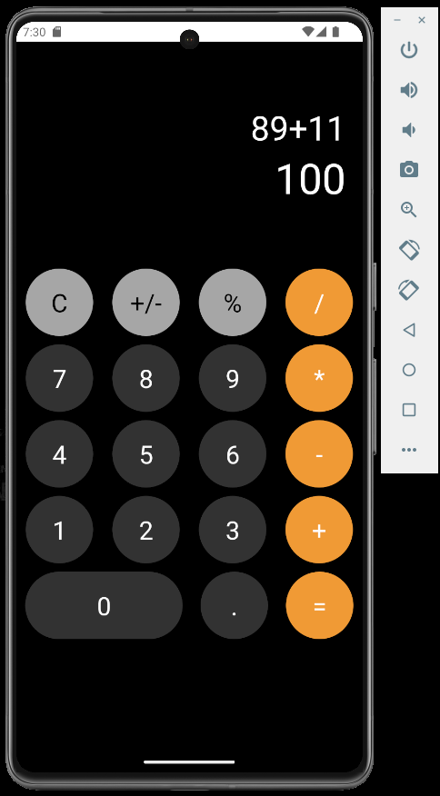

# React Native Calculator App

A simple and sleek calculator app built with React Native, inspired by the iPhone calculator.

## Features

- Basic arithmetic operations: addition, subtraction, multiplication, division
- Toggle positive/negative sign
- Percentage calculation
- Clear input
- Responsive layout

## Screenshots


## Getting Started

Follow these instructions to set up and run the project on your local machine.

### Prerequisites

- [Node.js](https://nodejs.org/) (version 14 or later)
- [Expo CLI](https://docs.expo.dev/get-started/installation/)

### Installation

1. Clone the repository:
    ```sh
    git clone https://github.com/yourusername/calculator-app.git
    cd calculator-app
    ```

2. Install dependencies:
    ```sh
    npm install
    ```

3. Start the Expo development server:
    ```sh
    npx expo start
    ```

4. Open the app on your device using the Expo Go app (available on iOS and Android) or in an emulator:
    - Scan the QR code generated in your terminal using the Expo Go app
    - Or press `a` to open the Android emulator, or `i` to open the iOS simulator

## Usage

- Launch the app on your device or emulator
- Perform arithmetic operations by pressing the buttons
- Use the `C` button to clear the input
- Use the `+/-` button to toggle the sign of the current input
- Use the `%` button to calculate the percentage of the current input
- Press `=` to evaluate the expression

## Code Structure

- `app\tabs\index.tsx`: Main component with the calculator logic and UI
- `styles`: Stylesheet for the calculator components